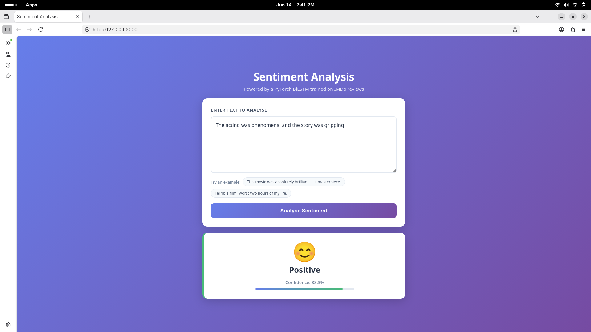

# Sentiment Analysis — PyTorch BiLSTM

Text classification project that predicts whether a review is **Positive** or **Negative** (extendable to Neutral).  
Trained on 50 000 IMDb movie reviews. Deployed as a FastAPI web app.

---

## How it works

```
Raw text  →  clean_text()  →  Vocabulary.encode()  →  BiLSTM model  →  Positive / Negative
```

1. **Text cleaning** — lowercase, strip HTML tags, remove URLs and punctuation
2. **Tokenisation** — split into words, map each word to an integer index
3. **Padding** — all sequences padded or truncated to 256 tokens
4. **BiLSTM** — reads the sequence forward and backward, concatenates both final hidden states
5. **Linear layer** — maps the 512-dimensional vector to 2 class scores

---

## Technologies

| Layer | Tool | Why |
|-------|------|-----|
| Language | Python 3.14 | — |
| Deep learning | PyTorch 2.12 | Industry-standard, full control over training loop |
| Model | Bidirectional LSTM | Captures both left→right and right→left context |
| Dataset | IMDb (HuggingFace `datasets`) | 50 000 balanced reviews, no account needed |
| Training environment | Google Colab T4 GPU | Free GPU, ~25 s/epoch |
| Web API | FastAPI + Uvicorn | Async, auto-generated docs at `/docs` |
| Frontend | HTML + CSS + Fetch API | No framework needed for a single-page form |
| Config | python-dotenv | All hyperparameters in `.env`, no code changes needed |
| ML utilities | scikit-learn | Confusion matrix, classification report |

---

## Project structure

```
sent/
├── .env                        # Hyperparameters (gitignored)
├── .env.example                # Template — copy to .env
├── .gitignore
├── requirements.txt
│
├── config.py                   # Reads .env, exposes typed constants
├── model.py                    # clean_text, Vocabulary, SentimentBiLSTM
├── predict.py                  # CLI inference
├── app.py                      # FastAPI web application
│
├── templates/
│   └── index.html              # Single-page frontend
├── static/
│   └── style.css
│
├── model/
│   ├── best_model.pth          # Trained weights (downloaded from Colab)
│   └── vocab.pkl               # Vocabulary mapping (downloaded from Colab)
│
└── Sentiment_Analysis_Colab.ipynb   # Full training notebook (run on Colab)
```

---

## Setup

```bash
# 1. Clone / enter the project directory
cd ~/Desktop/sent

# 2. Create and activate virtual environment
python3 -m venv .venv
source .venv/bin/activate        # Windows: .venv\Scripts\activate

# 3. Install dependencies
pip install -r requirements.txt

# 4. Copy config template
cp .env.example .env
```

---

## Train the model (Google Colab)

1. Open [colab.research.google.com](https://colab.research.google.com)
2. **File → Upload notebook** → select `Sentiment_Analysis_Colab.ipynb`
3. **Runtime → Change runtime type → T4 GPU**
4. **Runtime → Run all** — training takes ~5 minutes
5. At the end, run the download cell to save `best_model.pth` and `vocab.pkl`

Place the downloaded files in the `model/` directory:

```bash
mv ~/Downloads/best_model.pth model/best_model.pth
mv ~/Downloads/vocab.pkl      model/vocab.pkl
```

---

## Run locally

### CLI prediction

```bash
# Single sentence
python predict.py "The acting was phenomenal and the story was gripping"

# Interactive mode (type anything, Ctrl-C to quit)
python predict.py
```

Example output:
```
  Text       : The acting was phenomenal and the story was gripping
  Sentiment  : 😊  Positive
  Confidence : [██████████████████████████░░░░]  88.3%
```

### Web app

```bash
uvicorn app:app --reload --port 8000
```

Open **http://localhost:8000** — paste any review and click Analyse.  
API docs available at **http://localhost:8000/docs**.

### Health check

```bash
curl http://localhost:8000/health
```

---

## Configuration

All hyperparameters live in `.env`. Edit the file and restart — no code changes needed.

| Key | Default | Description |
|-----|---------|-------------|
| `MAX_VOCAB_SIZE` | 25000 | Number of unique words kept |
| `MAX_SEQ_LEN` | 256 | Tokens per review (truncate / pad) |
| `EMBED_DIM` | 128 | Word embedding size |
| `HIDDEN_DIM` | 256 | BiLSTM hidden state size per direction |
| `N_LAYERS` | 2 | Stacked LSTM layers |
| `DROPOUT` | 0.3 | Dropout probability |
| `NUM_CLASSES` | 2 | 2 = pos/neg · 3 = pos/neu/neg |
| `BATCH_SIZE` | 64 | Training batch size |
| `EPOCHS` | 10 | Max training epochs |
| `LEARNING_RATE` | 0.001 | Initial learning rate |
| `MODEL_PATH` | model/best_model.pth | Path to trained weights |
| `VOCAB_PATH` | model/vocab.pkl | Path to vocabulary file |

---

## Upgrade paths

### 3-class classification (positive / neutral / negative)

Set `NUM_CLASSES=3` in `.env`, then in the notebook replace the dataset cell:
```python
dataset   = load_dataset('tweet_eval', 'sentiment')  # 0=neg 1=neu 2=pos
train_raw = dataset['train']
test_raw  = dataset['test']
```

### BERT fine-tuning (~94-96% accuracy vs ~91% for BiLSTM)

```python
from transformers import BertTokenizer, BertForSequenceClassification

tokenizer  = BertTokenizer.from_pretrained('bert-base-uncased')
bert_model = BertForSequenceClassification.from_pretrained(
    'bert-base-uncased', num_labels=2
).to(device)
```

Replace the `Vocabulary.encode` step with `tokenizer(text, padding='max_length', truncation=True, max_length=256, return_tensors='pt')`.

---

## Interface



---

## Results

Trained on IMDb — 25 000 train / 25 000 test, binary labels.

| Metric | Score |
|--------|-------|
| Accuracy | ~91% |
| F1 (macro) | ~91% |
| Training time | ~5 min on T4 GPU |
| Model size | ~22 MB |
| Inference speed | < 5 ms per sentence (CPU) |
